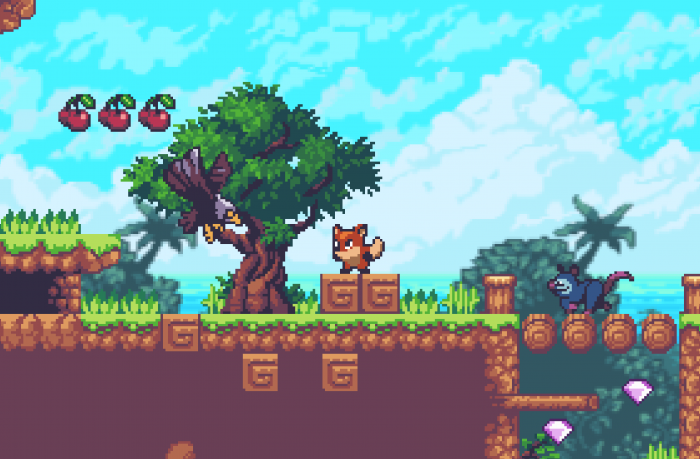
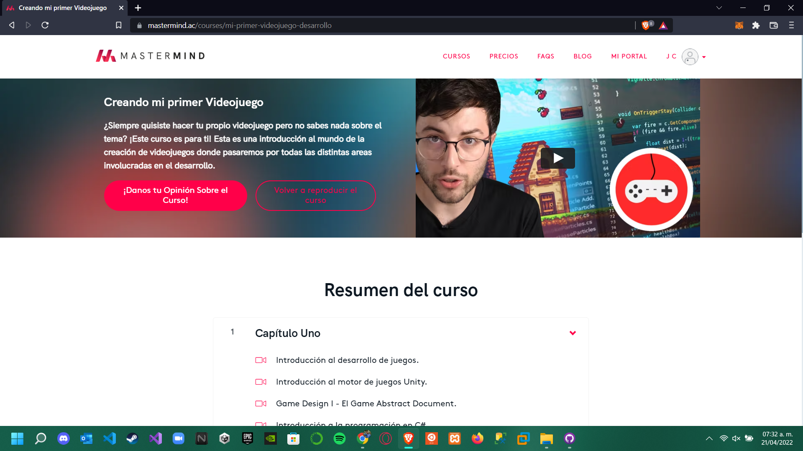

# Platformer-Game
 Juego de Plataformas hecho con el curso de Mastermind "Creando mi primer Videojuego" por el profesor Claudi Lázaro
 
¿Siempre quisiste hacer tu propio videojuego pero no sabes nada sobre el tema? ¡Este curso es para ti! Esta es una introducción al mundo de la creación de videojuegos donde pasaremos por todas las distintas areas involucradas en el desarrollo.

https://www.mastermind.ac/courses/mi-primer-videojuego-desarrollo

Assets usados: https://assetstore.unity.com/packages/2d/characters/sunny-land-103349
